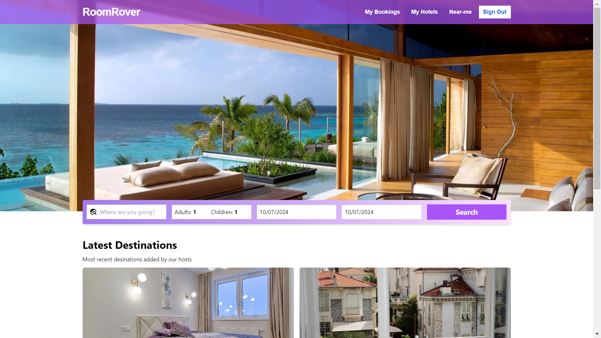
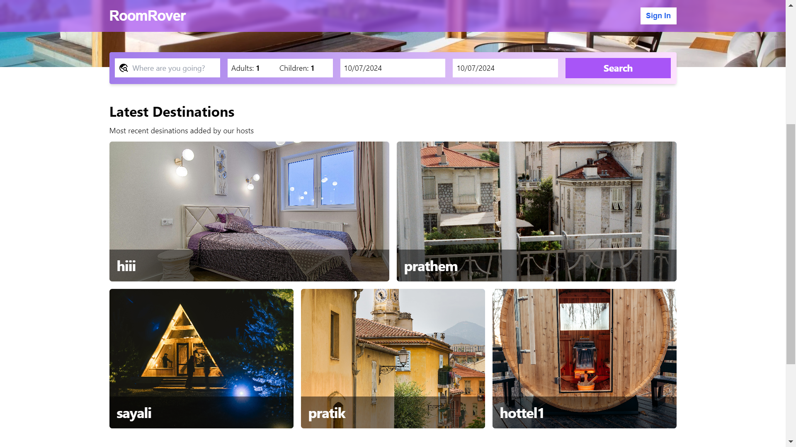
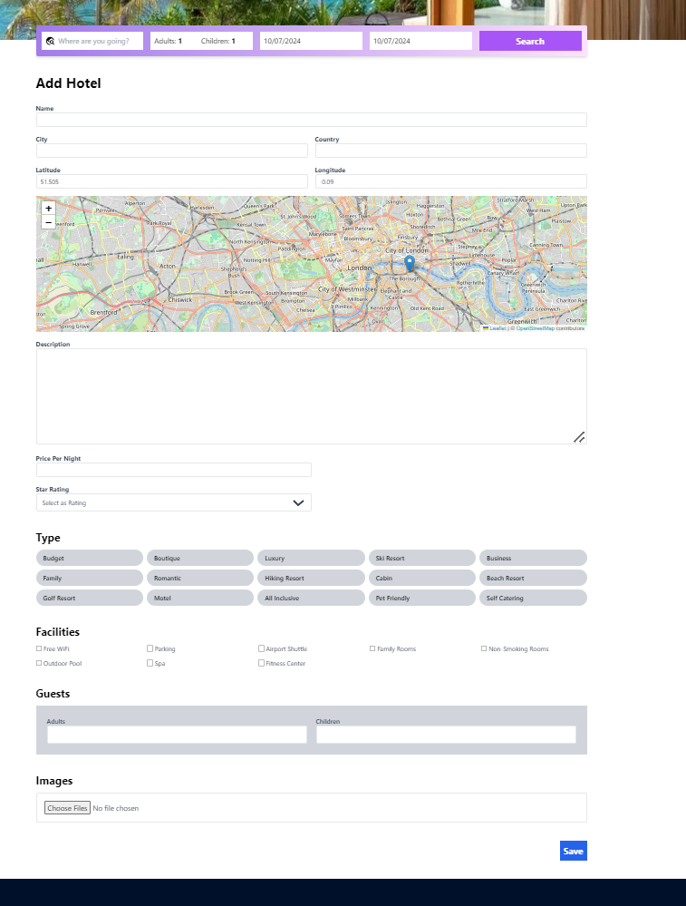
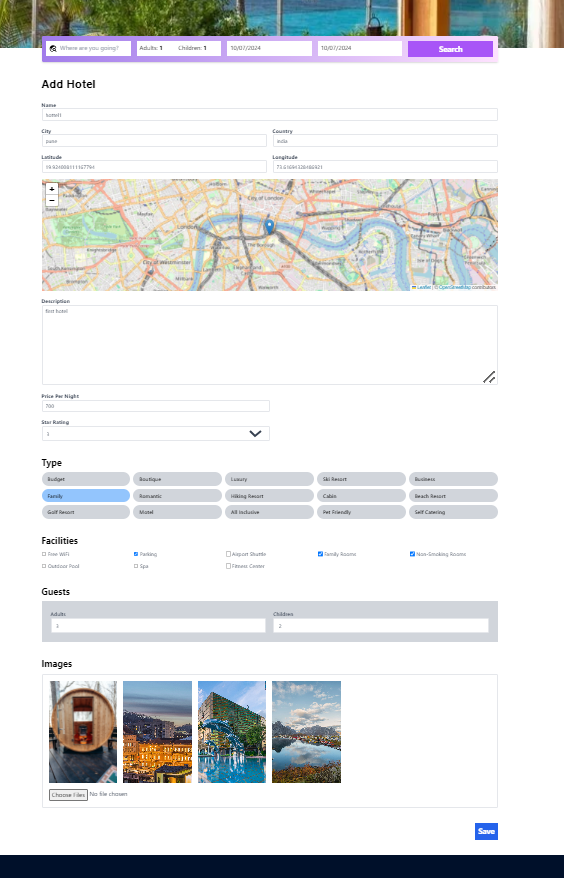
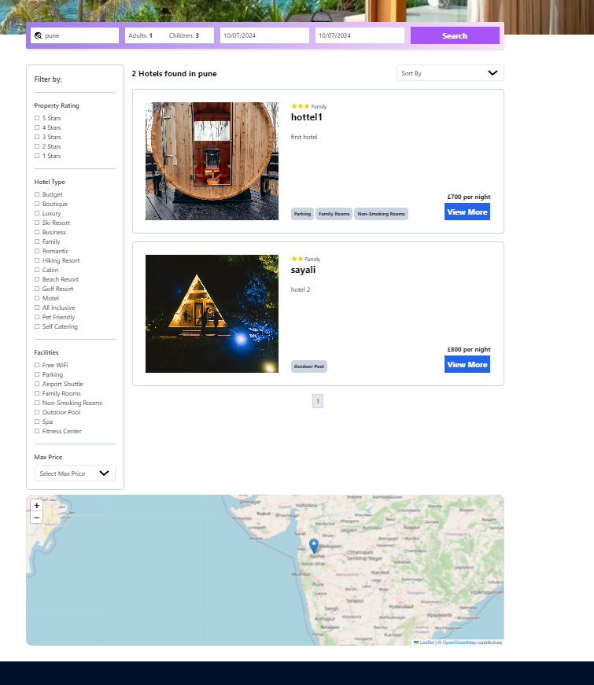
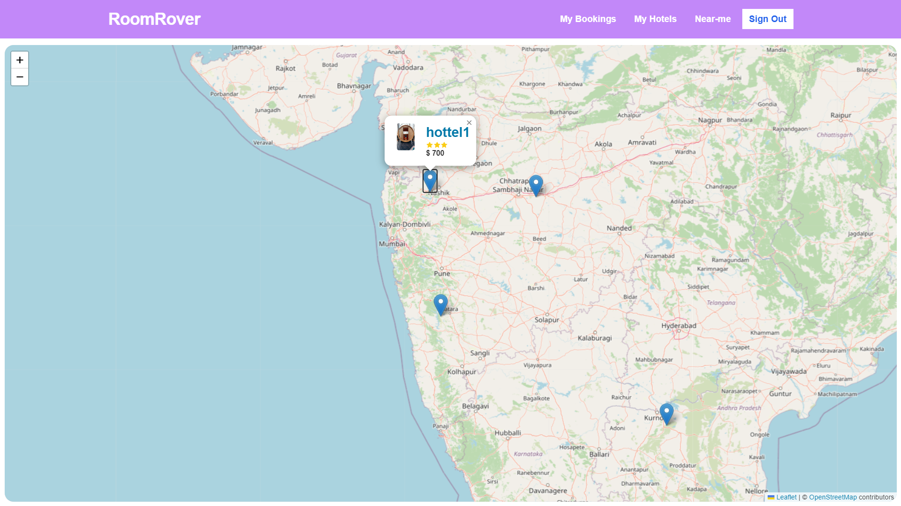
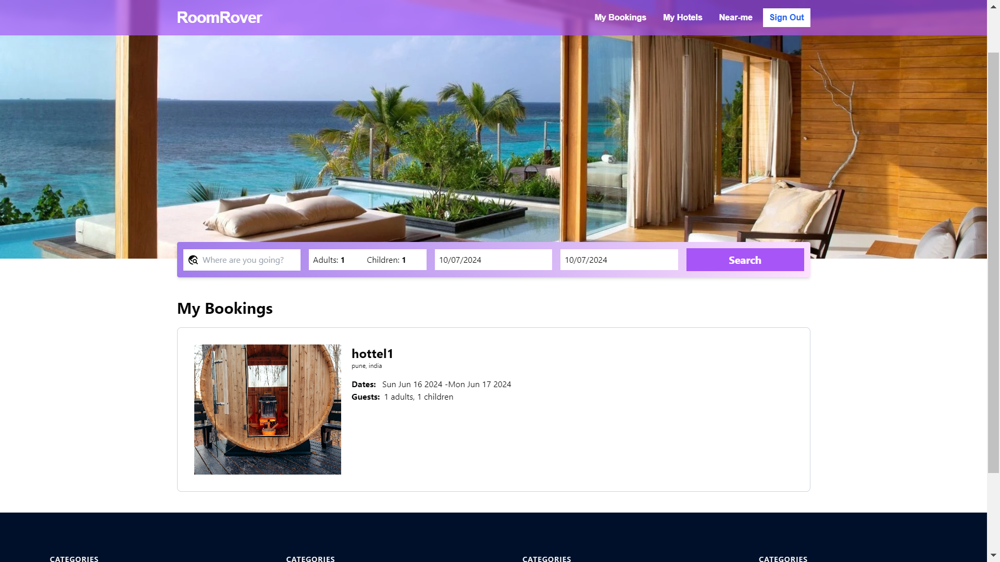
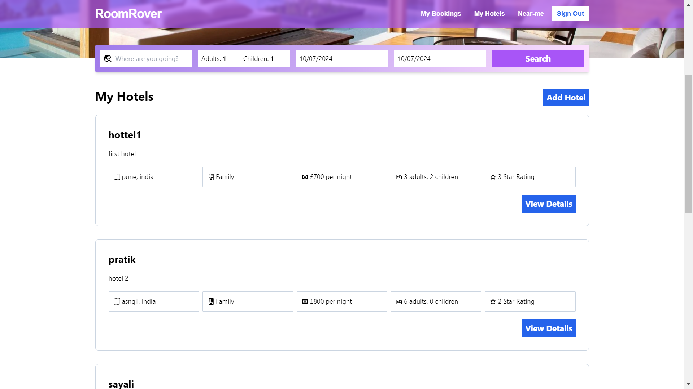

# RoomRover
Introducing RoomRover, a comprehensive hotel booking website that allows users to search for, compare, and book
hotel rooms easily with the additional feature enabling users to add their own hotels to the platform.
### Setup to the project

1. **frontend/.env setup**:
   ```bash
    VITE_API_BASE_URL=
    VITE_STRIPE_PUB_KEY=
    ```
2. **backend/.env setup**:
   ```bash
    MONGODB_CONNECTION_STRING=
    JWT_SECRET_KEY=
    FRONTEND_URL=
    CLOUDINARY_CLOUD_NAME=
    CLOUDINARY_API_KEY=
    CLOUDINARY_API_SECRET=
    STRIPE_API_KEY=
    ```
3. **Install dependencies**:
    ```bash
    npm i //in both frontend and backend
    ```
4. **Run the application(Open Integrated Terminal in all folder)**:
    ```bash
    npm run dev //in frontend
    npm start //in backend
    ```

## Landing Page


<br/>
<hr /> 
<br/>


## Add Hotels


<br/>
<hr /> 
<br/>


## Hotels Search 



## Hotels Near Me



## My Bookings



## My Hotels


